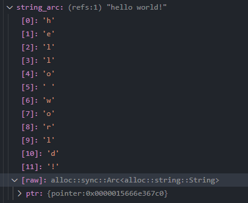
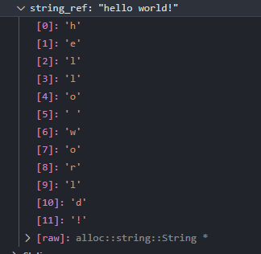
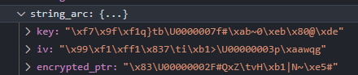
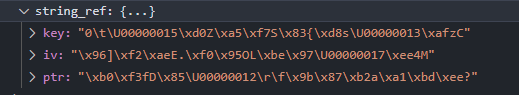

# encrypted-ptr

This allows you to encrypt references in Rust! Both normal references, and counted references (aka `Arc`s)

They're stored in-memory with a unique key and IV!

### Before

### After

## Questions That You're Probably Too Horrified To Ask But I Will Answer Anyways

### Why?

Why *aren't* you encrypting your pointers?

(also it might help against CheatEngine trainers or something idk)

### Won't they leak anyways?

For like a few instructions, yeah.

Sadly, processors do not understand the sheer importance of encrypting your pointers, and the raw decrypted pointer will need to be in a register at one point or another. Maybe ARM will implement it if we add more, uh, "idea juice" to their water (or they might just come up with a stupider name than "aarch64" instead)

### Is this sound?

Probably.

### Did you test this in miri?

It failed instantly.

### Should I use this in production?

Absolutely! (not)

### Won't this use up a lot of memory?

Yes. About 3x the memory per pointer. I don't think it fits in the stack, sorry.

### Won't this degrade performance?

Modern platforms have hardware-accelerated AES, so I wouldn't imagine it'd be *much* performance loss.

But yes, it would.

## License

`encrypted-ptr` is dual-licensed under the [Apache 2.0 license](LICENSE-MIT.md) or [MIT license](LICENSE-MIT.md). Use whichever one floats your boat.
